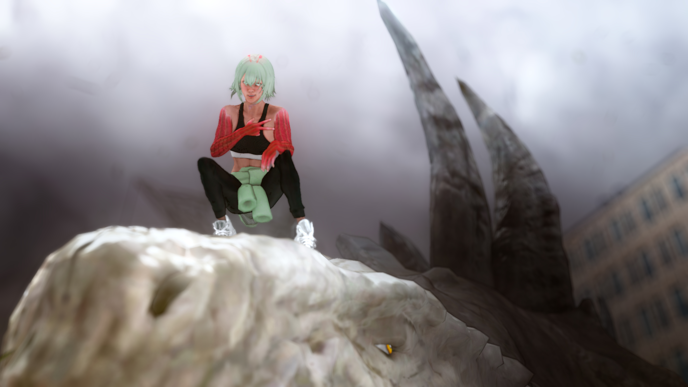

# Zhang Wei <!-- omit from toc -->

||
|:-:|
|Whats poppin!!!!|

## Table Of Contents <!-- omit from toc -->

- [History](#history)
- [Mechanics](#mechanics)
  - [Equipment](#equipment)
  - [Abilities](#abilities)
- [Personality](#personality)

## History

This alien comes from a race of humanoid ESPers. She is the “weakest of her kind”: no telepathy, no telekinesis, no flight, and no matter manipulation (they’re pretty OP). She only has the basic features of superhuman durability, and the basic ESP skills: capture, channel, switch.

Why is she here? She’s so weak her species' equivalent of NASA spent alotta Starbucks to mind-control our planet’s wizards and engineers to isekai her out of their civilization. Sad 😢, but thanks to human error, they summoned her to Sensei.

Sensei taught her how to integrate her essence capture and channeling abilities into some elaborate kicking and punching shit (bingewatched Jackie Chan lmao). Sensei is dead now. 😢 To honor their memory, this alien named herself after her teacher: **Zhang Wei**.

Zhang Wei is a martial artist and an alien, who comes from a race of humanoid ESPers. She works as a stuntwoman with an aspiration for acting.

## Mechanics

She is mainly a close quarters combatant who employs Taekwondo and Wing Chun styles. She mixes her powers into her martial arts to at least stay on edge with the roster.

### Equipment

- Airgun
- Rental car
- Cloak and mask

### Abilities

She has superhuman durability--her arms are a consequential feature of that. Any risky maneuver that would hurt a human, such as dropping from long heights or getting run over, barely hurts her. Her durability allows her to experiment and iterate (without punishment) on different, acrobatic maneuvers. She has a pretty stable stunt double career, thanks to that 😀. 

Her strength and speed is exceptional for human standards, below Olympian and above average, but she can’t lift a car nor can she "teleport" around with her nimbleness. She makes up for it with her ESPer skills:

- Essence Capture
- Essence Channel
- Essence Switch

To help explain her abilities, I’ll explain what she’d do if someone threw some poop at her

**Essence Capture** allows her to copy a “signature” of her world, up to two arm spans away from herself. A “signature” is the chemical makeup of an area of the world: the area is about her head’s size, and encompasses a cubic area. To capture a signature, that area must experience an impulse (a large force in a small period of time, like impacts). She can control this ability. She can capture up to 3 signatures. These signatures last until the end of the day.

Wei will shamelessly receive the poop on her arm. Now she’s got a poop signature

**Essence Channel** allows her to imbue any object (including herself) with the signature. The object won’t take up the material properties of the signature, but it’ll emit an aura (you can smell it!) which takes on the color of the signature. She can control this ability.

There’s a pebble on the ground. Wei will hold the pebble and channel it with the poop signature. A brown aura surrounds the pebble.

**Essence Switch** changes the “sign” of the signature into its antisignature—it inverts it, makes it negative. The aura’s color’s invert (and so does its smell). If the antisignature object and an object with a similar signature meet, it’ll produce an explosive energy. The more similar the object, the stronger the explosive force, and the more momentum each object carries on collision, the stronger the explosive force.

Wei switches the pebble’s poop signature and baseball pitches it back at someone’s poop stock. Poop goes 💥 because of the speed and the likeness of the signature.

## Personality

Other than her race and Sensei’s teachings, she doesn’t take many things seriously. Wei is also toxically Gen Z:

- She always posts her reels
- She tryhards on her (online) arguments to convince others she’s an alien
- She’s trying to get the latest kicks
- She’s on her phone
- She’ll complain if you leave her on *Read*
There’s a few more you can find online. Feel free to employ them to your interpretation!

Her sensei taught her to keep fights fair, but she’ll encourage you to go ham; she prefers any fight where she can use her abilities
